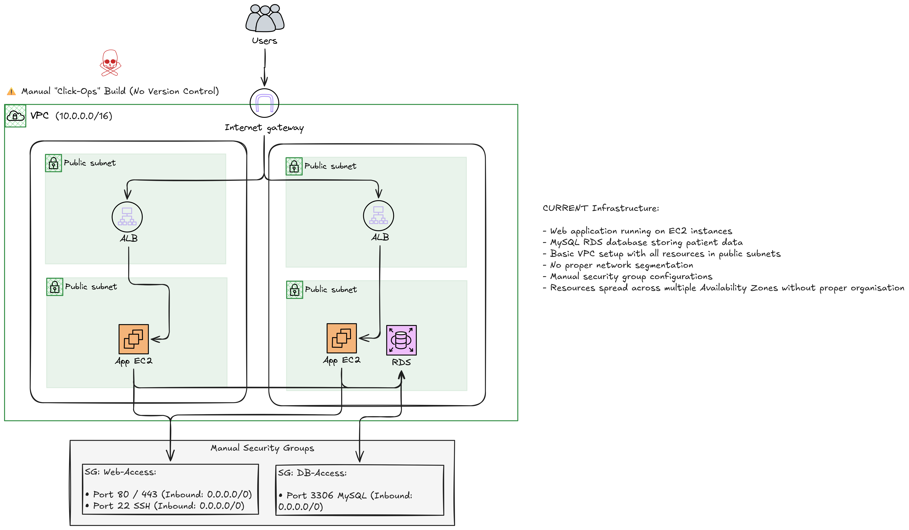
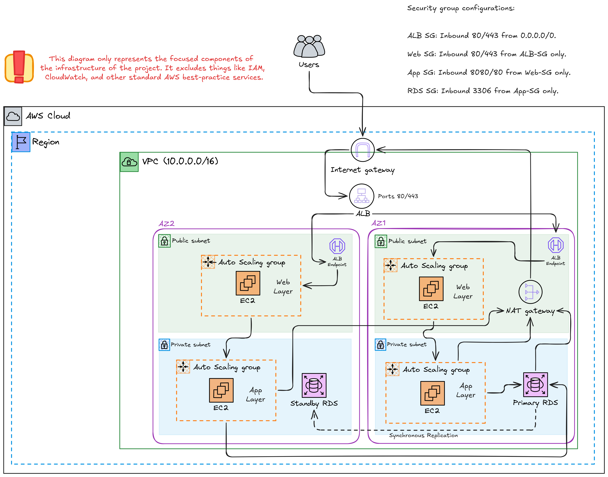
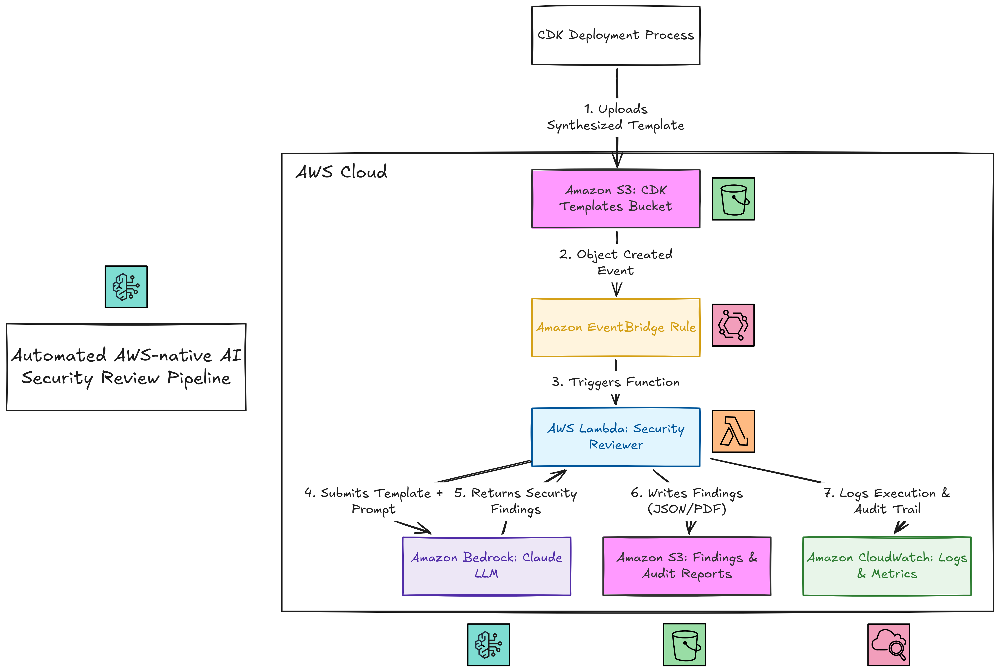

# TechHealth Inc. AWS Infrastructure Migration

## From manually managed healthcare infrastructure to an auditable AWS platform

TechHealth Inc. is a healthcare technology company with a patient portal running on AWS. Its infrastructure had been created manually through the AWS Console approximately five years earlier. That approach had become difficult to understand, reproduce, secure, and change with confidence.

This project tells the story of moving that environment toward Infrastructure as Code with AWS CDK and TypeScript, while redesigning the network architecture around isolation, availability, scalability, and operational traceability.

The project also includes a consultant-initiated addition: an AWS-native AI security review pipeline that automatically reviews synthesized CloudFormation templates with Amazon Bedrock before they are deployed.

## Project at a glance

| Area | Implementation |
|---|---|
| Infrastructure as Code | AWS CDK with TypeScript |
| Compute | EC2 Auto Scaling Groups for web and app layers |
| Networking | Two-AZ VPC with public and private subnets |
| Load balancing | Internet-facing Application Load Balancer |
| Database | Multi-AZ MySQL RDS in private subnets |
| Secrets | AWS Secrets Manager |
| Security review | S3, EventBridge, Lambda, Amazon Bedrock, and CloudWatch |
| Administration | AWS Systems Manager Session Manager instead of SSH |
| Evidence | AWS console screenshots, CloudWatch logs, connectivity test, and Bedrock report |

The application stacks were deployed, tested, and destroyed during the project. The repository contains the implementation, decisions, evidence, and sanitized review output without exposing the original AWS account identifier or personal CLI profile name.

## Why the migration was necessary

The original environment had the typical problems associated with infrastructure created manually over time:

- No version-controlled infrastructure changes.
- No reliable way to reproduce the environment.
- Limited traceability of who changed what and when.
- Outdated infrastructure documentation.
- Resources placed in a flat network layout.
- RDS and EC2 resources exposed through public subnets.
- Broad and manually managed security-group rules.
- No automated review of infrastructure changes before deployment.

For a healthcare workload handling patient data, these were not only operational problems. They increased the impact of an accidental network or IAM misconfiguration.

## The architecture journey

### 1. Establishing the current state

The first step was to document the existing architecture without correcting it. This created an honest baseline from which the target state could be designed.



### 2. Designing the target state

The target architecture separates the environment into three logical layers:

```text
Internet
   ↓
Application Load Balancer in public subnets
   ↓
Web Auto Scaling Group
   ↓
App Auto Scaling Group in private subnets
   ↓
Multi-AZ MySQL RDS in private subnets
```

The VPC spans two Availability Zones. Each Availability Zone contains a public subnet and a private subnet. The ALB and web layer use the public subnets, while the app and data layers use private subnets.



### 3. Adding an automated security review

The project brief did not originally require an AI security review pipeline. It was proposed as a consultant-initiated addition because manual review is easy to skip and security mistakes carry greater consequences in a healthcare environment.



## Key architectural decisions

The decisions log in [`docs/decisions.md`](docs/decisions.md) records the reasoning behind the implementation. The most important decisions were:

### Infrastructure as Code over console configuration

All infrastructure is defined with AWS CDK and TypeScript. This provides version control, repeatability, a CloudFormation audit trail, and a consistent deployment workflow.

### Three-tier network design

The architecture uses separate web, app, and data layers. Security groups permit traffic only from the layer directly above:

| Security group | Allowed inbound traffic |
|---|---|
| ALB | HTTP and HTTPS from the internet |
| Web | HTTP and HTTPS from the ALB security group |
| App | Application traffic from the web security group |
| RDS | MySQL on port 3306 from the app security group |

### NAT Gateway despite the cost concern

The original brief recommended avoiding NAT Gateways to reduce cost. That recommendation was deliberately overridden because the app layer is private and still needs controlled outbound access for updates and AWS service communication.

### Auto Scaling Groups

Both the web and app layers use Auto Scaling Groups rather than standalone instances. This supports multi-AZ availability, automatic replacement of unhealthy instances, and future scaling.

### Multi-AZ RDS

The MySQL database uses Multi-AZ deployment with a standby in a separate Availability Zone. A read replica was considered and rejected because the additional cost and operational overhead were not justified at this scale.

### SSM instead of SSH

The EC2 instances use AWS Systems Manager Session Manager and the `AmazonSSMManagedInstanceCore` policy. No inbound SSH rule is required, reducing the attack surface and removing the need to manage SSH keys for the test environment.

## CDK implementation

The CDK project is under [`IaC/`](IaC/). It contains two stacks.

### `TechHealthInfrastructureStack`

This stack creates:

- Two-AZ VPC.
- Public and private subnets.
- Internet Gateway.
- NAT Gateway.
- Application Load Balancer.
- Web and app Auto Scaling Groups.
- Launch templates and EC2 instance profiles.
- Multi-AZ MySQL RDS.
- Secrets Manager database credentials.
- Layered security groups.
- IAM roles for EC2 instances.

### `TechHealthPipelineStack`

This stack creates:

- S3 bucket for synthesized CloudFormation templates.
- S3 bucket for findings and audit reports.
- EventBridge rule for S3 Object Created events.
- Python 3.12 security reviewer Lambda.
- Bedrock invocation permissions.
- AWS Marketplace permissions required for initial Anthropic model activation.
- CloudWatch log group and execution logging.

The CDK app obtains the target account from the active CDK and AWS credentials rather than storing an account ID in the repository. See [`IaC/README.md`](IaC/README.md) for prerequisites, deployment commands, pipeline testing, and teardown instructions.

## How the security review pipeline works

The pipeline is event-driven:

```text
Synthesized CloudFormation template
              ↓
S3 template bucket
              ↓
EventBridge Object Created event
              ↓
Security reviewer Lambda
              ↓
Amazon Bedrock Claude review
              ↓
JSON findings report in S3
              ↓
CloudWatch execution logs
```

The Lambda reviews each template against four checks derived from the project brief:

1. RDS public access.
2. SSH access restriction.
3. Least-privilege IAM.
4. Network segmentation.

The pipeline surfaces findings for human review. It does not automatically approve or block a deployment. That boundary was intentional so that automation removes the effort of running a review without removing human accountability for accepting or rejecting findings.

## Pipeline testing and lessons learned

The first end-to-end pipeline test succeeded, although the exact reason the first invocation worked was not established. After the environment was torn down and recreated, subsequent tests exposed several Bedrock prerequisites.

### Anthropic first-time-use form

Bedrock initially rejected the model invocation because Anthropic use-case details had not been submitted for the account. The first-time-use form was completed in the Bedrock console.

### AWS Marketplace permissions

The next invocation failed because the Lambda execution role lacked the AWS Marketplace permissions Bedrock uses to activate third-party Anthropic models. The pipeline stack was updated to grant:

```text
aws-marketplace:ViewSubscriptions
aws-marketplace:Subscribe
aws-marketplace:Unsubscribe
```

The stack was synthesized and redeployed, and the account was given time to complete the subscription process.

### Successful retry

A new S3 object key was used for the retry so that a fresh Object Created event would trigger the complete pipeline. The retry succeeded:

- S3 received the template.
- EventBridge detected the upload.
- Lambda retrieved the template.
- Bedrock returned a security review.
- Lambda wrote the findings report.
- CloudWatch recorded the execution.

The troubleshooting history is documented in Task 6 of [`docs/decisions.md`](docs/decisions.md).

## Security review results

The initial live review returned a HIGH risk rating and identified two genuine findings:

1. The web tier was deployed in public subnets.
2. The web and app layers shared an EC2 IAM role.

These findings were intentionally left in place so the project could demonstrate that the pipeline identifies real architectural risks rather than only producing a clean example report. In a production engagement, the web tier would be moved into private subnets and the IAM roles would be separated by tier.

The successful later retry produced a detailed Bedrock assessment with a MEDIUM risk rating. It confirmed that:

- RDS public access passed.
- SSH exposure passed because SSH was not configured.
- Least-privilege IAM passed for the reviewed infrastructure template.
- Network segmentation failed because the web instances were in public subnets.

The generated report is stored in [`AI-Security-Review-Pipeline-Reports/`](AI-Security-Review-Pipeline-Reports/). It is currently JSON, which is suitable for machine processing and audit storage. A JSON-to-Markdown converter can be used to produce a more readable human-facing version, and the Lambda could be updated to write Markdown directly in a future iteration.

The report metadata contains one minor presentation limitation: the top-level risk field is `UNKNOWN` because the Lambda parser did not recognize the Markdown-bold formatting used by Claude, while the findings text itself clearly reports `MEDIUM`. This does not affect the successful pipeline execution or the detailed findings.

## Evidence collected

The evidence is organized into three screenshot groups.

### Architecture diagrams

Located in [`screenshots/Diagrams/`](screenshots/Diagrams/):

- Current-state architecture.
- Target-state architecture.
- Automated AI security review pipeline.

### Infrastructure evidence

Located in [`screenshots/Infrastructure/`](screenshots/Infrastructure/):

- CloudFormation stack deployment.
- EC2-to-RDS connectivity through SSM.
- ALB, web, app, and RDS security groups.
- RDS configuration and private placement.
- RDS and app network isolation.
- Internet Gateway and NAT Gateway routing.
- Auto Scaling Group configuration.
- ALB listener and target status.
- Secrets Manager configuration.
- CloudFormation outputs.

### Pipeline evidence

Located in [`screenshots/AI-Security-Review-Pipeline/`](screenshots/AI-Security-Review-Pipeline/):

- Pipeline stack deployment.
- Template upload to S3.
- EventBridge event pattern and target.
- Lambda execution.
- CloudWatch logs.
- Findings report and report details.

These materials provide direct evidence of the deployed resources and the end-to-end review flow rather than relying only on source code or architecture diagrams.

## Testing against the project brief

The project brief required evidence of:

- Successful EC2-to-RDS connectivity.
- Security groups working as intended.
- Network isolation.
- Consistent deployment and destruction.

The project demonstrates these through the infrastructure screenshots, the SSM-based MySQL connectivity test, the security review findings, the CloudFormation deployment output, and the completed teardown of the application stacks.

The environment was destroyed after testing to avoid continued charges from the NAT Gateway, Multi-AZ RDS, load balancer, and EC2 resources. The shared CDK bootstrap environment is separate from the application stacks.

## Repository guide

| Path | Purpose |
|---|---|
| [`IaC/`](IaC/) | AWS CDK TypeScript project and Lambda implementation |
| [`IaC/README.md`](IaC/README.md) | CDK setup, deployment, testing, and teardown guide |
| [`docs/decisions.md`](docs/decisions.md) | Architectural decisions, implementation issues, findings, and evidence record |
| [`architecture/`](architecture/) | Editable architecture diagrams |
| [`screenshots/Diagrams/`](screenshots/Diagrams/) | Architecture diagram exports |
| [`screenshots/Infrastructure/`](screenshots/Infrastructure/) | Infrastructure configuration and testing evidence |
| [`screenshots/AI-Security-Review-Pipeline/`](screenshots/AI-Security-Review-Pipeline/) | Pipeline execution evidence |
| [`AI-Security-Review-Pipeline-Reports/`](AI-Security-Review-Pipeline-Reports/) | Sanitized Bedrock findings report |

## Lessons learned

### CDK requires the correct working directory

The CDK CLI needs to run from the directory containing the relevant `cdk.json`, or it must be given an explicit app. Running deployment commands from the repository root without an app configuration produces an `--app is required` error.

### Bootstrap is account and region scoped

CDK bootstrap creates the shared `CDKToolkit` environment for an account and region. It is not tied to the folder from which the command is run, and it is separate from the application stacks.

### Global Bedrock inference profiles require careful configuration

Global Anthropic inference profiles use the `us-east-1` Bedrock runtime endpoint even when the Lambda runs in another region. IAM permissions and AWS Marketplace model activation must also be considered during the first invocation.

### Evidence is part of the engineering work

A deployed stack is not enough to tell the full story. The screenshots, CloudWatch logs, connectivity test, and durable findings report make the design and its operational behavior reviewable by someone who was not present during the build.

### Intentional weaknesses can demonstrate a control effectively

The web-tier public-subnet issue was retained deliberately after the security review identified it. Documenting why a finding was accepted is more valuable than silently correcting it and presenting only a clean result.

## Final status

This project demonstrates:

- A migration from manually managed AWS infrastructure to CDK.
- A redesigned multi-AZ, three-tier architecture.
- Layered network and IAM controls.
- Secure database credential storage.
- SSM-based EC2 administration without SSH exposure.
- An AWS-native Bedrock security review pipeline.
- Successful end-to-end event-driven automation.
- Evidence-based testing and documentation.
- Transparent documentation of trade-offs, failures, fixes, and remaining limitations.

The application resources have been destroyed after testing. The repository remains as a public, reproducible record of the architecture, implementation, security review process, and engineering decisions.
